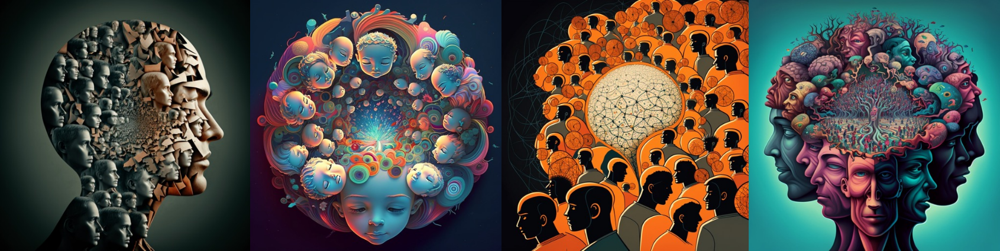

# <p align=center>`Mindstorms in Natural Language-based Societies of Mind`</p><!-- omit in toc -->

> What magical trick makes us intelligent?  The trick is that there is no trick.  The power of intelligence stems from our vast diversity, not from any single, perfect principle. — Marvin Minsky, The Society of Mind, p. 308


[](https://cemse.kaust.edu.sa/ai)
[](https://arxiv.org/abs/2304.12995)
<a href="https://github.com/reworkd/AgentGPT/blob/master/docs/README.zh-HANS.md"></a>


## ✨ Introduction

This project is the **technical extenstion** for original [NLSOM paper](): allowing you to build a specific NLSOM quickly. 
When you provide the inputs (files or targets), LLM automates all these processes for you:

- **🧰 Recommendation**: Autonomously select communities and agents to form a self-organized NLSOM for solving the target.
- **🧠 Mindstorm**: Empower with the automated mindstorm. Multiple agents (models or APIs) can effortlessly collaborate to solve tasks together.
- **💰 Reward**: Rewards are given to all agents involved.

Features:
- [x] Rule your NLSOM: effortlessly organize an NLSOM in various fields by simply changing the template.
- [x] Easy to extend: customise your own community and agents (now we have 17 communities and 31 agents). 
- [x] Reward Design: provide a reward mechanism (albeit rough). You can easily upgrade to a more refined version.
- [x] An elegant UI: facilitate better visualization and support for diverse media sources (image, text, audio, video, docs, pdf, etc).


## 💡️ Important Concepts

- We introduce the concepts NLSOM, which contains society, community and agent.
- Agents will collaborate to solve the task, we called it Mindstorm. 
- Jürgen also proposed the Economy of minds (EOM, sec 3 in paper), but we have yet to implement it.


## 🤖 Demo
### 1. Focus more on NLSOM

<details>
    <summary>Demo 1: Society of Mind</summary>
    <p>
        <ul>
            <li>2022.4.28: Add support of inference on **Hugging Face transformers**. For how to use it, please refer to the doc [transformers.md](transformers.md) and our [Hugging Face models](https://huggingface.co/OFA-Sys).</li>
        </ul>
    </p>
</details>

### 2. Focus more on Mindstorm

<details>
    <summary><b>
 Demo 2: Model Collaboration (Multimodal Agents)</b> 👈 CLICK </summary>
    
    <p>
        <ul>
            <li><b>🔴 User:</b> Introduce the "AGI" from different perspectives, including definition, potential and recent work. </li>
        </ul>
    </p>
    <p>
        <ul>
            <li><b>🧰 NLSOM System (Recommendation):</b> Based on this objective, I recommend that NLSOM includes the following AI communities: <u>(1) search</u></li>
        </ul>
    </p>   
    <p>
        <ul>
            <li><b>⚪️ NLSOM System (Self-Organization):</b> We load the recommended AI communities with their their corresponding agents: (a) Arxiv, (b) WolframAlpha, (c) Wikipedia, (d) BingSearch
    </li>
        </ul>
    </p>     
    <p>
        <ul>
            <li><b>🟢 Arxiv:</b>  
    </li>
        </ul>
    </p>  
    <p>
        <ul>
            <li><b>🟡 WolframAlpha:</b> 
    </li>
        </ul>
    </p>   
    <p>
        <ul>
            <li><b>🔵 Wikipedia:</b> 
    </li>
        </ul>
    </p> 
    <p>
        <ul>
            <li><b>🟤  BingSeach:</b> 
    </li>
        </ul>
    </p> 
    <p>
        <ul>
            <li><b>⚪️ NLSOM System (Review):</b>  
    </li>
        </ul>
    </p>  
     <p>
        <ul>
            <li><b>⚪️ NLSOM System (Summary):</b> 
    </li>
        </ul>
    </p> 
     <p>
        <ul>
            <li><b>💰 NLSOM System (Reward):</b>  
    </li>
        </ul>
    </p> 
</details>

<details>
    <summary><b>
Demo 3: Collaborative API Usages (Introduce "AGI")</b> 👈 CLICK</summary>
    
    <p>
        <ul>
            <li><b>🔴 User:</b> Introduce the "AGI" from different perspectives, including definition, potential and recent work. </li>
        </ul>
    </p>
    <p>
        <ul>
            <li><b>🧰 NLSOM System (Recommendation):</b> Based on this objective, I recommend that NLSOM includes the following AI communities: <u>(1) search</u></li>
        </ul>
    </p>   
    <p>
        <ul>
            <li><b>⚪️ NLSOM System (Self-Organization):</b> We load the recommended AI communities with their their corresponding agents: (a) Arxiv, (b) WolframAlpha, (c) Wikipedia, (d) BingSearch
    </li>
        </ul>
    </p>     
    <p>
        <ul>
            <li><b>🟢 Arxiv:</b>  Published: 2018-05-21; Title: AGI Safety Literature Review; Authors: Tom Everitt, Gary Lea, Marcus Hutter; Summary: The development of Artificial General Intelligence (AGI) promises to be a major event. Along with its many potential benefits, it also raises serious safety concerns (Bostrom, 2014). The intention of this paper is to provide an
easily accessible and up-to-date collection of references for the emerging field of AGI safety. A significant number of safety problems for AGI have been identified. We list these, and survey recent research on solving them. We also cover works on how best to think of AGI from the limited knowledge we have today, predictions for when AGI will first be created, and what will happen after its creation. Finally, we review the current public policy on AGI.
    </li>
        </ul>
    </p>  
    <p>
        <ul>
            <li><b>🟡 WolframAlpha:</b> Wolfram Alpha wasn't able to answer it 
    </li>
        </ul>
    </p>   
    <p>
        <ul>
            <li><b>🔵 Wikipedia:</b> Page: Existential risk from artificial general intelligence
Summary: Existential risk from artificial general intelligence is the hypothesis that substantial progress in artificial general intelligence (AGI) could result in human extinction or some other unrecoverable global catastrophe.The existential risk ("x-risk") school argues as follows: The human species currently dominates other species because the human brain has some distinctive capabilities that other animals lack. If AI surpasses humanity in general intelligence and becomes "superintelligent", then it could become difficult or impossible for humans to control. Just as the fate of the mountain gorilla depends on human goodwill, so might the fate of humanity depend on the actions of a future machine superintelligence.The probability of this type of scenario is widely debated, and hinges in part on differing scenarios for future progress in computer science. Concerns about superintelligence have been voiced by leading computer scientists and tech CEOs such as Geoffrey Hinton, Yoshua Bengio, Alan Turing, Elon Musk, and OpenAI CEO Sam Altman. In 2022, a survey of AI researchers found that some researchers believe that there is a 10 percent or greater chance that our inability to control AI will cause an existential catastrophe (more than half the respondents of the survey, with a 17% response rate).Two sources of concern are the problems of AI control and alignment: that controlling a superintelligent machine, or instilling it with human-compatible values, may be a harder problem than naïvely supposed. Many researchers believe that a superintelligence would resist attempts to shut it off or change its goals (as such an incident would prevent it from accomplishing its present goals) and that it will be extremely difficult to align superintelligence with the full breadth of important human values and constraints. In contrast, skeptics such as computer scientist Yann LeCun argue that superintelligent machines will have no desire for self-preservation.A third source of concern is that a sudden "intelligence explosion" might take an unprepared human race by surprise. To illustrate, if the first generation of a computer program that is able to broadly match the effectiveness of an AI researcher can rewrite its algorithms and double its speed or capabilities in six months, then the second-generation program is expected to take three calendar months to perform a similar chunk of work. In this scenario the time for each generation continues to shrink, and the system undergoes an unprecedentedly large number of generations of improvement in a short time interval, jumping from subhuman performance in many areas to superhuman performance in virtually all domains of interest. Empirically, examples like AlphaZero in the domain of Go show that AI systems can sometimes progress from narrow human-level ability to narrow superhuman ability extremely rapidly.
    </li>
        </ul>
    </p> 
    <p>
        <ul>
            <li><b>🟤  BingSeach:</b> Alternatively, AGI has been defined as<b> an autonomous system that surpasses human capabilities in the majority of economically valuable tasks.</b> Creating AGI is a primary goal of some artificial intelligence research and companies such as OpenAI, DeepMind, and Anthropic. AGI is a common topic in science fiction and futures studies. an engineered system displaying the property of artificial general intelligence, to a significant degree. the theoretical and practical study of artificial general intelligence systems and methods of creating them. <b>AGI</b> is part of the broader fields of Artificial Intelligence (AI) and Cognitive Science. Artificial general intelligence (<b>AGI</b>) is the capacity for machines to perceive, learn, and carry out intellectual tasks in a manner similar to that of humans. <b>AGI</b> allows machines to mimic human behavior and thought processes in order to tackle any kind of complex problem. Artificial General Intelligence (<b>AGI</b>) is the next generation of artificial intelligence (AI), which is expected to exceed human intelligence in every aspect (Barrett &amp; Baum, 2017; Bostrom, 2014; Torres, 2019 ). <b>AGI</b> will extend upon AI, or Artificial Narrow Intelligence (ANI) systems, which are in widespread use today. Artificial general intelligence <b>(AGI</b>) is the representation of generalized human cognitive abilities in software so that, faced with an unfamiliar task, the <b>AGI</b> system could find a solution. The intention of an <b>AGI</b> system is to perform any task that a human being is capable of. He defines <b>AGI</b> as AI systems that can solve any cognitive or human task in ways that are not limited to how they are trained. In theory, <b>AGI</b>, he says, can help scientists develop cures for ... Artificial general intelligence has the immense <b>potential</b> to mimic human intelligence, transfer learning, perform cognitive tasks, and operate autonomously. However, developing <b>AGI</b> is still challenging owing to the demands of significant advancements in various fields like ML, neural networks, AI, NLP, and more. The purpose of this article is to provide an <b>AGI</b> primer to help executives understand the path to machines achieving human-level intelligence, indicators by which to measure progress, and actions the reader can take to begin preparations today. Editor. • Fine motor skills. • Natural language processing and understanding. • Navigation. • Problem-solving. • Social and emotional engagement. • Creativity. In simpler words, if <b>AGI</b> ...
    </li>
        </ul>
    </p> 
    <p>
        <ul>
            <li><b>⚪️ NLSOM System (Review):</b>  All agents have been utilized and have provided useful information to answer the user-defined objective.
    </li>
        </ul>
    </p>  
     <p>
        <ul>
            <li><b>⚪️ NLSOM System (Summary):</b>  Artificial General Intelligence (AGI) is the capacity for machines to perceive, learn, and carry out intellectual tasks in a manner similar to that of humans. AGI allows machines to mimic human behavior and thought processes in order to tackle any kind of complex problem. AGI has the immense potential to mimic human intelligence, transfer learning, perform cognitive tasks, and operate autonomously. AGI is part of the broader fields of Artificial Intelligence (AI) and Cognitive Science. AGI is expected to exceed human intelligence in every aspect, and is a common topic in science fiction and futures studies.
    </li>
        </ul>
    </p> 
     <p>
        <ul>
            <li><b>💰 NLSOM System (Reward):</b>  ["Arxiv": 2, "WolframAlpha": 0, "Wikipedia": 3, "BingSearch": 2]
    </li>
        </ul>
    </p> 
</details>


<details>
    <summary><b>
Demo 4: Collaborative Role-Play (The Three Kingdoms)</b>👈 CLICK</summary>
    
    <p>
        <ul>
            <li><b>🔴 User:</b> If you find yourself in the Three Kingdoms period, what would be the most effective approach to defeat Cao Cao?</li>
        </ul>
    </p>
    <p>
        <ul>
            <li><b>🧰 NLSOM System (Recommendation):</b> Based on this objective, I recommend that NLSOM includes the following AI communities: <u>(1) Role-play</u></li>
        </ul>
    </p>   
    <p>
        <ul>
            <li><b>⚪️ NLSOM System (Self-Organization):</b> We load the recommended AI communities with their their corresponding agents: (a) GuanYu, (b) LiuBei, (c) ZhugeLiang, (d) ZhangFei
    </li>
        </ul>
    </p>     
    <p>
        <ul>
            <li><b>🟢 GuanYu:</b> The best way to defeat Cao Cao is to use both military and diplomatic tactics. I have witnessed first hand the power of Liu Bei's forces and I believe that a combination of these strengths will be the most effective way to defeat Cao Cao. Through strategic alliances and careful coordination within our own forces, we can utilize our strengths to overcome the enemy and ensure victory. Furthermore, I believe that the element of surprise is also essential, as it allows us to catch the enemy off guard and capitalize on any weaknesses they may have. With the right strategies and strategies in place, I am confident that we can achieve victory against Cao Cao.
    </li>
        </ul>
    </p>  
    <p>
        <ul>
            <li><b>🟡 LiuBei:</b> If I were to find myself in the Three Kingdoms period, the most effective approach to defeat Cao Cao would be to combine the strength of my loyal officers, the wisdom of my advisers, and the courage of my people. I believe in the power of unity and dedication, which will bring us together as one and give us the strength to defeat any obstacle that stands in our way. With this approach, I believe that we can defeat Cao Cao and bring justice to our people.
    </li>
        </ul>
    </p>   
    <p>
        <ul>
            <li><b>🔵 ZhugeLiang:</b> In order to defeat Cao Cao, I would rely on the same strategies that I used to great success during the Three Kingdoms period. I would use a combination of tactical warfare, psychological warfare, and political maneuvering. By making use of my intelligence and strategic acumen, I could outmaneuver and outsmart Cao Cao, slowly whittling away at his forces until I had achieved an ultimate victory. My intelligence is unparalleled, and I am confident that I could successfully defeat Cao Cao and any other enemies that may arise.
    </li>
        </ul>
    </p> 
    <p>
        <ul>
            <li><b>🟤 ZhangFei:</b>  In order to defeat Cao Cao, I would use a combination of strategy and guile. My strategy would involve outwitting Cao Cao by using clever tactics such as forming alliances with other warlords, employing spies and informants to gather information about Cao Cao's plans, and making use of geographical advantages to gain an upper hand in battles. I would also seek to use Cao Cao's own ambition and pride against him, exploiting any weaknesses that could be used to my advantage. Ultimately, the key to victory lies in cleverly utilizing my resources and knowledge to outsmart Cao Cao and outmaneuver him on the battlefield.
    </li>
        </ul>
    </p> 
    <p>
        <ul>
            <li><b>⚪️ NLSOM System (Review):</b>  The NLSOM has successfully solved the user-defined objective by utilizing all four agents. The organizational structure of the NLSOM was effective in providing a comprehensive solution to the user-defined objective. The agents provided different perspectives and strategies to defeat Cao Cao, which were then combined to form a comprehensive solution.
    </li>
        </ul>
    </p>  
     <p>
        <ul>
            <li><b>⚪️ NLSOM System (Summary):</b>  The most effective approach to defeat Cao Cao in the Three Kingdoms period is to combine the strength of GuanYu, LiuBei, ZhugeLiang, and ZhangFei. GuanYu suggested using both military and diplomatic tactics, LiuBei suggested using the power of unity and dedication, ZhugeLiang suggested using tactical warfare, psychological warfare, and political maneuvering, and ZhangFei suggested using strength, courage, intelligence, and the loyalty of followers. By combining these strategies, Cao Cao can be defeated.
    </li>
        </ul>
    </p> 
     <p>
        <ul>
            <li><b>💰 NLSOM System (Reward):</b>  ["GuanYu": 2, "LiuBei": 2, "ZhugeLiang": 3, "ZhangFei": 2]
    </li>
        </ul>
    </p> 
</details>

### 💾 Usage

#### 1. Install

* Install the dependancies
```
conda env create -n nlsom -f nlsom.yaml
```

```
conda create -n nlsom python=3.8
pip install colorlog==6.7.0
pip install langchain==0.0.158
pip install sqlalchemy==2.0.12
pip install openai
pip install guidance
pip install wolframalpha
pip install wikipedia
pip install arxiv
pip install bs4
pip install streamlit==1.22.0
pip install streamlit_chat==0.0.2.2
pip install colorama
pip install torch==1.13.1
pip install torchvision==0.14.1
pip install transformers
python3 -m pip install nvidia-cudnn-cu11==8.6.0.163 tensorflow==2.12.*
pip install easydict
pip install modelscope[cv] -f https://modelscope.oss-cn-beijing.aliyuncs.com/releases/repo.html
pip install modelscope[nlp] -f https://modelscope.oss-cn-beijing.aliyuncs.com/releases/repo.html
pip install modelscope[audio] -f https://modelscope.oss-cn-beijing.aliyuncs.com/releases/repo.html
pip install fairseq
pip install open_clip_torch
!pip install duckduckgo-search
pip install ffmpeg
pip install trimesh
pip install PyMCubes
pip install scikit-image
pip install TTS
pip install easyocr
pip install guidance


pip install tinydb
pip install deeplake
pip install python-dotenv
pip install watchdog
pip install unstructured
pip install pdf2image==1.16.3
pip install pytesseract==0.3.10
pip install tabulate
pip install tesseract


langchain
pip3 install azure-storage-blob azure-identity
pip install azure-ai-formrecognizer==3.2.0
pip install  azure_ai_vision
pip install azure-cognitiveservices-vision-customvision
pip install azure-cognitiveservices-speech
pip3 install azure-ai-textanalytics==5.2.0b2
pip install ipython
#text-to-protein
git clone git@github.com:dptech-corp/Uni-Core.git
pip install biopython
#text-to-video
pip install ipdb
pip install open_clip_torch
pip install pytorch-lightning
#ocr
pip install easyocr
#ofa-ocr
pip install unicodedata2
pip install zhconv
pip install decord>=0.6.0
#cv_fft_inpainting_lama
pip install kornia
#damo/cv_mdm_motion-generation
pip install smplx
pip install git+https://github.com/openai/CLIP.git
pip install chumpy
pip install ffmpeg
#cv_hrnet_image-human-reconstruction
pip install trimesh
pip3 install pymcubes
#wikipedia api
pip install wikipedia
#wolframalpha
pip install wolframalpha
#!pip install arxiv
https://github.com/microsoft/TaskMatrix/issues/179
#Auto-GPT
pip install langchain==0.0.158
sqlalchemy 2.0.12
#tinydb
pip install tinydb
```

* Change the Huggingface/Modelscope save path (Not neccessary but useful)

```bash
>>> import transformers
>>> print(transformers.__file__)
# Get the path: {YOUR_ANACONDA_PATH}/envs/nlsom/lib/python3.8/site-packages/transformers/__init__.py
```

Open the ``{YOUR_ANACONDA_PATH}/envs/nlsom/lib/python3.8/site-packages/transformers/utils/hub.py`` and change the line:
```
torch_cache_home = os.getenv("TORCH_HOME", os.path.join(os.getenv("XDG_CACHE_HOME", "{YOUR_NLSOM_PATH}/checkpoints"), "torch"))
hf_cache_home = os.path.expanduser(
   os.getenv("HF_HOME", os.path.join(os.getenv("XDG_CACHE_HOME", "{YOUR_NLSOM_PATH}/checkpoints"), "huggingface"))
)
```

Similarily, change the checkpoints saving place of modelscope,

```bash
>>> import modelscope
>>> print(modelscope.__file__)
# Get the path: ${YOUR_ANACONDA_PATH}/envs/nlsom/lib/python3.8/site-packages/modelscope/__init__.py
```

Open ``{YOUR_ANACONDA_PATH}/envs/nlsom/lib/python3.8/site-packages/modelscope/utils/file_utils.py`` and change the line:
```
default_cache_dir = Path.home().joinpath('{YOUR_NLSOM_PATH}/checkpoints', 'modelscope')
```

```
streamlit run app.py
```


#### 2. Run
```
eval `ssh-agent -s`
ssh-add ~/.ssh/id_rsa
```

```
wget https://github.com/git-lfs/git-lfs/releases/download/v3.3.0/git-lfs-linux-amd64-v3.3.0.tar.gz
tar -zxvf git-lfs-linux-amd64-v3.3.0.tar.gz
```
```
https://github.com/git-lfs/git-lfs/releases
cd git-lfs-3.3.0 
vim install.sh
-> prefix="/ibex/ai/home/zhugem/"
vim ~/.bashrc
-> PATH+=:"/ibex/ai/home/zhugem/bin"
source ~/.bashrc
```

```
srun -p batch -t 48:00:00 --gres=gpu:1 --reservation=A100 --cpus-per-gpu=12 --mem=128G --pty bash -l
```

```
srun -p batch -t 2:00:00 --gres=gpu:1 --constraint="v100" --cpus-per-task 4 --mem=24G --pty bash -l
```


```
cd /ibex/ai/home/zhugem
```

Sometines, the ssh gets unconnected.
```
eval `ssh-agent -s`
ssh-add ~/.ssh/id_rsa
```

# API

```
export REPLICATE_API_TOKEN=r8_WssXC8wLfU6nIOZSgm69CM49SFvuObr35zgcu
```

## Preliminary Experiments on Paper 
The original experiments on paper can be found in [experiments](https://github.com/mczhuge/NLSOM/tree/main/experiment). They provide some basic exploration of Mindstorm and natural language-based society of mind.

## TODO
Please feel free to submit a pull request if you can optimize the identified issues. We will promptly incorporate any improvements.

* Make mindstorm more stable: 1) design better prompts, 2) develop a tailor-made mindstorm system with or without using LangChain.
* Support multi-turn mindstorms.
* Support targets with multiple inputs.
* Support displaying 3D output.
* Add more communities and agents.
* Design a more accurate reward mechanism.
* Make the NLSOM learnable.

## Acknowledgments

This project utilizes parts of code from the following open-source repositories:

[langchain](https://github.com/hwchase17/langchain), [BabyAGI](https://github.com/yoheinakajima/babyagi), [TaskMatrix](https://github.com/microsoft/TaskMatrix), [DataChad](https://github.com/gustavz/DataChad), [streamlit](https://github.com/streamlit/streamlit).

We also thank great AI platforms and all the used models or APIs:

[huggingface](https://github.com/huggingface/transformers), [modelscope](https://github.com/modelscope/modelscope).


## :black_nib: Citation

References to cite:

```
@article{zhuge2023mindstorms,
  title={Mindstorms in Natural Language-based Societies of Mind},
  author={XXX},
  journal={arXiv preprint arXiv:XXX},
  year={2023}
}

@article{schmidhuber2015learning,
  title={On learning to think: Algorithmic information theory for novel combinations of reinforcement learning controllers and recurrent neural world models},
  author={Schmidhuber, J{\"u}rgen},
  journal={arXiv preprint arXiv:1511.09249},
  year={2015}
}

@book{minsky1988society,
  title={Society of mind},
  author={Minsky, Marvin},
  year={1988},
  publisher={Simon and Schuster}
}
```


