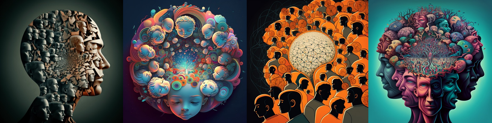

# <p align=center>`Natural Language-Based Societies of Mind`</p><!-- omit in toc -->

> What magical trick makes us intelligent?  The trick is that there is no trick.  The power of intelligence stems from our vast diversity, not from any single, perfect principle. — Marvin Minsky, The Society of Mind, p. 308

[](https://cemse.kaust.edu.sa/ai)
[](https://arxiv.org/pdf/2305.17066.pdf)
[](https://github.com/mczhuge/NLSOM/blob/main/LICENSE)
[](https://hits.seeyoufarm.com)

## ✨ Introduction
We introduce the **Natural Language-Based Societies of Mind (NLSOM)** concept, which contains societies and communities of agents.

#### 🔥 News: 
- [Dylan R. Ashley](https://dylanashley.io) will give a presentation of NLSOM in [NeurIPS RO-FoMo](https://sites.google.com/view/r0-fomo/accepted-papers?authuser=0) workshop. See our [poster](https://metauto.ai/images/nlsom-v9.pdf).
- [This position paper](https://arxiv.org/pdf/2305.17066.pdf) marks the beginning. Our vision continues to unfold and grow stronger!  
- **We finished this repo in early May but was released 7 months later**. 

#### 1. Concepts:
- Agents can be either LLMs, NN-based experts, APIs and role-players. They all communicate in natural language.
- To solve tasks, these agents use a collaborative "Mindstorm" process involving mutual interviews.
- Additional components for NLSOM can be easily added in a modular way.
- <details>
    <summary>More insights 👈 <b>[CLICK]</b></summary>
        <p>
         <ul>
             <li><b> Concepts of NLSOMs:</b> Both Minsky’s “Society of Mind” and Schmidhuber’s “Learning to Think” inspire diverse societies of large multimodal neural networks (NNs) that solve problems by interviewing each other in a “Mindstorm.” Recent implementations of NN-based societies of minds consist of large language models (LLMs) and other NN-based experts communicating through a natural language interface. In doing so, they overcome the limitations of single LLMs, improving multimodal zero-shot reasoning. In these natural language-based societies of mind (NLSOMs), new agents—all communicating through the same universal symbolic language—are easily added in a modular fashion. </li>
         </ul>
     </p>        
     <p>
        <ul>
            <li><b> Process:</b>   In this GitHub project, 1) our first step is to recommend relevant communities and agents aligned with the users' goals. These recommendations encompass tools, plugins, models, and role-players, which can then be loaded accordingly. 2) Additionally, we employ a Mindstorm approach, setting ourselves apart from previous models like VisualChatGPT and HuggingGPT, which solely rely on a single model for a specific function. Within our framework, a community of agents shares a common function, such as "search", while each agent possesses unique strengths and capabilities. For instance, agents like "Bing Search," "Wikipedia," "arXiv," and "WolframAlpha" collaborate to provide a more comprehensive understanding. 3) Furthermore, we emphasize the importance of reward mechanisms. In our current implementation, we reward different models for their contributions to task completion, which serves as a valuable means of evaluating a model's usefulness for specific tasks.
            </li>
        </ul>
    </p>     
     <p>
        <ul>
            <li><b> Outlook:</b>   The concept behind this project is to provide a preliminary NLSOM solution. To illustrate, let's consider a scenario where a non-technical individual lacks expertise in computer science and has limited knowledge about various AI plugins. In such cases, the NLSOM system can automatically recommend different communities and agents to automate tasks based on user input in natural language. Even without understanding the performance of a specific model, the user can benefit from multiple models with the same functionality working together to offer more comprehensive answers. These AI communities can collaborate and compete with each other. Furthermore, the NLSOM system implements a reward mechanism that grants AI models a higher status based on their performance. This reward mechanism serves the purpose of optimizing the end-to-end recommendation/Mindstorm process in the future. It establishes a system akin to a Darwinian meritocracy within the AI community, where models compete and succeed based on their demonstrated excellence.
            </li>
        </ul>
    </p>     
</details>

#### 2. About this repo:
This project is the **technical extension** for the original [NLSOM paper](https://arxiv.org/pdf/2305.17066.pdf), including:

- **🧰 Recommendation**: Autonomously select communities and agents to form a self-organized NLSOM for solving the specified task.
- **🧠 Mindstorm**: Multiple agents (models or APIs) can collaborate to solve tasks together more efficiently.
- **💰 Reward**: Rewards are given to all agents involved.

#### 3. Features:
- [x] Manage Easily: Simply change the template to organize your NLSOM in different areas.
- [x] Easy to extend: customize your own community and agents (Now we have 16 communities and 34 agents, see [society](https://github.com/mczhuge/NLSOM/tree/main/society)). 
- [x] Reward Design: provide a reward mechanism (albeit rough). You can easily upgrade to a more refined version. 
- [x] Elegant UI: has an interface and support for diverse file sources (image, text, audio, video, etc).


<div align=center>
    
</div>

## 💾 Usage

### 1. Install
 
Choose from three different installation methods to find the one that best fits your needs.

1. CONDA: ``conda env create -n nlsom -f nlsom.yaml``

2. PIP: ``conda create -n nlsom python=3.8`` and then ``pip install -r requirements.txt``

<details><summary>3. Step-by-step installation (Recommended and more controllable) </summary>
<p>
    
```bash
# [Set Conda Env] 
conda create -n nlsom python=3.8
conda install pytorch==1.10.1 torchvision==0.11.2 torchaudio==0.10.1 -c pytorch
pip install pandas==1.4.3
# [Set LangChain, OpenAI]
pip install langchain==0.0.158
pip install sqlalchemy==2.0.12
pip install openai
pip install colorama
# [Set Streamlit]
cd assets && unzip validators-0.20.0.zip
cd validators-0.20.0
python setup.py build
python setup.py install
pip install streamlit==1.22.0
pip install streamlit_chat==0.0.2.2
pip install soundfile
# [Set Huggingface/transformers]
pip install transformers==4.29.2
pip install accelerate==0.19.0
# [Set Search]
pip install wolframalpha
pip install wikipedia
pip install arxiv
# [Set Modelscope]
pip install modelscope==1.6.0
python3 -m pip install nvidia-cudnn-cu11==8.6.0.163 tensorflow==2.12.*
export LD_LIBRARY_PATH=$LD_LIBRARY_PATH:$CONDA_PREFIX/lib/:$CUDNN_PATH/lib
python3 -c "import tensorflow as tf; print(tf.config.list_physical_devices('GPU'))"
pip install modelscope[multi-modal]
pip install decord==0.6.0
pip install fairseq
pip install librosa
pip install setuptools==59.5.0
pip install tensorboardX
pip install open_clip_torch
# [Set OCR]
pip install easyocr
# [Set Text-to-Video]
pip install replicate==0.8.3
# [Set Image-to-3D]
pip install trimesh
pip3 install pymcubes
# [Set TTS] - not recommended due to environmental conflicts
pip install TTS
pip install protobuf==3.20.3
```
    
</p>
</details>

<details><summary>Optional. Manage the dir of checkpoints  </summary>
<p>

* Create the checkpoints dir
```
mkdir checkpoints && cd checkpoints
mkdir huggingface
mkdir modelscope
```

* Change Huggingface's setting
```bash
>>> import transformers
>>> print(transformers.__file__)
# Get the path: {YOUR_ANACONDA_PATH}/envs/nlsom/lib/python3.8/site-packages/transformers/__init__.py
```

Open the ``{YOUR_ANACONDA_PATH}/envs/nlsom/lib/python3.8/site-packages/transformers/utils/hub.py`` and change the line:
```
torch_cache_home = os.getenv("TORCH_HOME", os.path.join(os.getenv("XDG_CACHE_HOME", "{YOUR_NLSOM_PATH}/checkpoints"), "torch"))
hf_cache_home = os.path.expanduser(
   os.getenv("HF_HOME", os.path.join(os.getenv("XDG_CACHE_HOME", "{YOUR_NLSOM_PATH}/checkpoints"), "huggingface"))
)
```

* Similarly, the modelscope's setting

```bash
>>> import modelscope
>>> print(modelscope.__file__)
# Get the path: ${YOUR_ANACONDA_PATH}/envs/nlsom/lib/python3.8/site-packages/modelscope/__init__.py
```

Open ``{YOUR_ANACONDA_PATH}/envs/nlsom/lib/python3.8/site-packages/modelscope/utils/file_utils.py`` and change the line:
```
default_cache_dir = Path.home().joinpath('{YOUR_NLSOM_PATH}/checkpoints', 'modelscope')
```
    
</p>
</details>

### 2. APIs

Please complete the API keys in ``.env.template``. The OpenAI API key is mandatory, while the others depend on your specific requirements. Then, ``mv .env.template .env``

### 3. App

```bash
streamlit run app.py
```


## 🧸 Demo

#### 1. Focus more on Mindstorm

<details>
    <summary>
 Demo 1: Model Collaboration (Multimodal Agents) 👈 <b>[CLICK]</b></summary>
    
    <p>
        <ul>
            <li><b>🔴 User:</b> VQA question: What century were these invented in?
        </ul>
    </p>
    <p>
        <ul>
            <li><b>🧰 NLSOM System (Recommendation):</b> Based on this objective, I recommend that NLSOM includes the following AI communities: <u>(1) vqa</u></li>
        </ul>
    </p>   
    <p>
        <ul>
            <li><b>⚪️ NLSOM System (Self-Organization):</b> We load the recommended AI communities with their their corresponding agents: (a) BLIP2_VQA, (b) mPLUG_VQA, (c) OFA_VQA
    </li>
        </ul>
    </p>     
    <p>
        <ul>
            <li><b>🟢 BLIP2_VQA:</b>  The 20th century was the century of the airplane.
    </li>
        </ul>
    </p>  
    <p>
        <ul>
            <li><b>🟡 mPLUG_VQA:</b> 21st
    </li>
        </ul>
    </p>   
    <p>
        <ul>
            <li><b>🔵 OFA_VQA:</b> 20th
    </li>
        </ul>
    </p> 
    <p>
        <ul>
            <li><b>⚪️ NLSOM System (Review):</b>  Whether the NLSOM has utilized all the agents? Yes 2) Whether the NLSOM has solved the user-defined objective? Yes
        </ul>
    </p>  
     <p>
        <ul>
            <li><b>⚪️ NLSOM System (Summary):</b> The invention of the airplane was in the 20th century.
    </li>
        </ul>
    </p> 
     <p>
        <ul>
            <li><b>💰 NLSOM System (Reward):</b>  ["BLIP2_VQA": 3, "mPLUG_VQA": 2, "OFA_VQA": 3]
    </li>
        </ul>
    </p> 
      </p> 
     <p>
        <ul>
            <li><b>📝 Human (Jürgen): </b> While the ground-truth answer (Orville Wright made the first powered flight in 1903) in this VQA dataset is in line with the commonly held belief, in this instance the common belief is, in fact, incorrect. Please see: https://people.idsia.ch/~juergen/planetruth.html
    </li>
        </ul>
    </p>   
    
</details>


<details>
    <summary>
Demo 2: Collaborative API Usages (Introduce "AGI") 👈 <b>[CLICK]</b></summary>
    
    <p>
        <ul>
            <li><b>🔴 User:</b> Introduce the "AGI" from different perspectives, including definition, potential. </li>
        </ul>
    </p>
    <p>
        <ul>
            <li><b>🧰 NLSOM System (Recommendation):</b> Based on this objective, I recommend that NLSOM includes the following AI communities: <u>(1) search</u></li>
        </ul>
    </p>   
    <p>
        <ul>
            <li><b>⚪️ NLSOM System (Self-Organization):</b> We load the recommended AI communities with their their corresponding agents: (a) Arxiv, (b) WolframAlpha, (c) Wikipedia, (d) BingSearch
    </li>
        </ul>
    </p>     
    <p>
        <ul>
            <li><b>🟢 Arxiv:</b>  Published: 2018-05-21; Title: AGI Safety Literature Review; Authors: Tom Everitt, Gary Lea, Marcus Hutter; Summary: The development of Artificial General Intelligence (AGI) promises to be a major event. Along with its many potential benefits, it also raises serious safety concerns (Bostrom, 2014). The intention of this paper is to provide an
easily accessible and up-to-date collection of references for the emerging field of AGI safety. A significant number of safety problems for AGI have been identified. We list these, and survey recent research on solving them. We also cover works on how best to think of AGI from the limited knowledge we have today, predictions for when AGI will first be created, and what will happen after its creation. Finally, we review the current public policy on AGI.
    </li>
        </ul>
    </p>  
    <p>
        <ul>
            <li><b>🟡 WolframAlpha:</b> Wolfram Alpha wasn't able to answer it 
    </li>
        </ul>
    </p>   
    <p>
        <ul>
            <li><b>🔵 Wikipedia:</b> Page: Existential risk from artificial general intelligence
Summary: Existential risk from artificial general intelligence is the hypothesis that substantial progress in artificial general intelligence (AGI) could result in human extinction or some other unrecoverable global catastrophe.The existential risk ("x-risk") school argues as follows: The human species currently dominates other species because the human brain has some distinctive capabilities that other animals lack. If AI surpasses humanity in general intelligence and becomes "superintelligent", then it could become difficult or impossible for humans to control. Just as the fate of the mountain gorilla depends on human goodwill, so might the fate of humanity depend on the actions of a future machine superintelligence.The probability of this type of scenario is widely debated, and hinges in part on differing scenarios for future progress in computer science...
    </li>
        </ul>
    </p> 
    <p>
        <ul>
            <li><b>🟤  BingSeach:</b> Alternatively, AGI has been defined as<b> an autonomous system that surpasses human capabilities in the majority of economically valuable tasks.</b> Creating AGI is a primary goal of some artificial intelligence research and companies such as OpenAI, DeepMind, and Anthropic. AGI is a common topic in science fiction and futures studies. an engineered system displaying the property of artificial general intelligence, to a significant degree. the theoretical and practical study of artificial general intelligence systems and methods of creating them...
    </li>
        </ul>
    </p> 
    <p>
        <ul>
            <li><b>⚪️ NLSOM System (Review):</b>  All agents have been utilized and have provided useful information to answer the user-defined objective.
    </li>
        </ul>
    </p>  
     <p>
        <ul>
            <li><b>⚪️ NLSOM System (Summary):</b>  Artificial General Intelligence (AGI) is a representation of generalized human cognitive abilities in software so that, faced with an unfamiliar task, the AGI system could find a solution. AGI has the potential to mimic human intelligence, transfer learning, perform cognitive tasks, and operate autonomously. AGI is part of the broader fields of Artificial Intelligence (AI) and Cognitive Science. AGI has been studied in terms of its potential to cause an existential risk, its ability to control and align with human values, and its potential to cause an intelligence explosion.
    </li>
        </ul>
    </p> 
     <p>
        <ul>
            <li><b>💰 NLSOM System (Reward):</b>  ["Arxiv": 2, "WolframAlpha": 0, "Wikipedia": 3, "BingSearch": 2]
    </li>
        </ul>
    </p> 
</details>


<details open>
    <summary>
Demo 3: Collaborative Role-Play (The Three Kingdoms)</summary>
    
    <p>
        <ul>
            <li><b>🔴 User:</b> If you find yourself in the Three Kingdoms period, what would be the most effective approach to defeat Cao Cao?</li>
        </ul>
    </p>
    <p>
        <ul>
            <li><b>🧰 NLSOM System (Recommendation):</b> Based on this objective, I recommend that NLSOM includes the following AI communities: <u>(1) Role-play</u></li>
        </ul>
    </p>   
    <p>
        <ul>
            <li><b>⚪️ NLSOM System (Self-Organization):</b> We load the recommended AI communities with their their corresponding agents: (a) GuanYu, (b) LiuBei, (c) ZhugeLiang, (d) ZhangFei
    </li>
        </ul>
    </p>     
    <p>
        <ul>
            <li><b>🟢 GuanYu:</b> The best way to defeat Cao Cao is to use both military and diplomatic tactics. I have witnessed first hand the power of Liu Bei's forces and I believe that a combination of these strengths will be the most effective way to defeat Cao Cao. Through strategic alliances and careful coordination within our own forces, we can utilize our strengths to overcome the enemy and ensure victory. Furthermore, I believe that the element of surprise is also essential, as it allows us to catch the enemy off guard and capitalize on any weaknesses they may have. With the right strategies and strategies in place, I am confident that we can achieve victory against Cao Cao.
    </li>
        </ul>
    </p>  
    <p>
        <ul>
            <li><b>🟡 LiuBei:</b> If I were to find myself in the Three Kingdoms period, the most effective approach to defeat Cao Cao would be to combine the strength of my loyal officers, the wisdom of my advisers, and the courage of my people. I believe in the power of unity and dedication, which will bring us together as one and give us the strength to defeat any obstacle that stands in our way. With this approach, I believe that we can defeat Cao Cao and bring justice to our people.
    </li>
        </ul>
    </p>   
    <p>
        <ul>
            <li><b>🔵 ZhugeLiang:</b> In order to defeat Cao Cao, I would rely on the same strategies that I used to great success during the Three Kingdoms period. I would use a combination of tactical warfare, psychological warfare, and political maneuvering. By making use of my intelligence and strategic acumen, I could outmaneuver and outsmart Cao Cao, slowly whittling away at his forces until I had achieved an ultimate victory. My intelligence is unparalleled, and I am confident that I could successfully defeat Cao Cao and any other enemies that may arise.
    </li>
        </ul>
    </p> 
    <p>
        <ul>
            <li><b>🟤 ZhangFei:</b>  In order to defeat Cao Cao, I would use a combination of strategy and guile. My strategy would involve outwitting Cao Cao by using clever tactics such as forming alliances with other warlords, employing spies and informants to gather information about Cao Cao's plans, and making use of geographical advantages to gain an upper hand in battles. I would also seek to use Cao Cao's own ambition and pride against him, exploiting any weaknesses that could be used to my advantage. Ultimately, the key to victory lies in cleverly utilizing my resources and knowledge to outsmart Cao Cao and outmaneuver him on the battlefield.
    </li>
        </ul>
    </p> 
    <p>
        <ul>
            <li><b>⚪️ NLSOM System (Review):</b>  The NLSOM has successfully solved the user-defined objective by utilizing all four agents. The organizational structure of the NLSOM was effective in providing a comprehensive solution to the user-defined objective. The agents provided different perspectives and strategies to defeat Cao Cao, which were then combined to form a comprehensive solution.
    </li>
        </ul>
    </p>  
     <p>
        <ul>
            <li><b>⚪️ NLSOM System (Summary):</b>  The most effective approach to defeat Cao Cao in the Three Kingdoms period is to combine the strength of GuanYu, LiuBei, ZhugeLiang, and ZhangFei. GuanYu suggested using both military and diplomatic tactics, LiuBei suggested using the power of unity and dedication, ZhugeLiang suggested using tactical warfare, psychological warfare, and political maneuvering, and ZhangFei suggested using strength, courage, intelligence, and the loyalty of followers. By combining these strategies, Cao Cao can be defeated.
    </li>
        </ul>
    </p> 
     <p>
        <ul>
            <li><b>💰 NLSOM System (Reward):</b>  ["GuanYu": 2, "LiuBei": 2, "ZhugeLiang": 3, "ZhangFei": 2]
    </li>
        </ul>
    </p> 
</details>

#### 2. Focus more on NLSOM


<details open>
    <summary>
 Demo 4: Society of Mind (Automatical Task-Solving)</summary>
      <p>
        <ul>
            <li>🔴 <b>User:</b> Provide an image. <br> 
        </ul>
    </p>
    <p>
        <ul>
            <li>🔴 <b>User:</b> Turn this photo into color, generate a description based on the colored image, and then use the description to generate a video. </li>
        </ul>
    </p>
    <p>
        <ul>
            <li>🧰 <b>NLSOM System (Recommendation):</b> Based on this objective, I recommend that NLSOM includes the following AI communities: <u>(1) image_colorization, (2) image_captioning, (3) text_to_video </u></li>
        </ul>
    </p>   
    <p>
        <ul>
            <li>⚪️ <b>NLSOM System (Self-Organization):</b> We load the recommended AI communities with their their corresponding agents: (a) DDColor, (b) OFA_large_captioning, (c) DeforumSD
    </li>
        </ul>
    </p>     
    <p>
        <ul>
            <li>🟢 <b>DDColor:</b>  <br>  </li>
    </li>
        </ul>
    </p>  
    <p>
        <ul>
            <li>🟡 <b>OFA_large_captioning:</b> a portrait of an old man with white hair
        </ul>
    </p>   
    <p>
        <ul>
            <li>🔵 <b>DeforumSD:</b> <br> 
                <video autoplay loop src="https://github.com/mczhuge/NLSOM/assets/64179323/62fb8500-6c22-4ed4-bf61-bc3bc0a843bb" width="200px" height="243px">
</video>
    </li>
        </ul>
    </p> 
    <p>
        <ul>
            <li>⚪️ <b>NLSOM System (Review):</b>  1) Whether the NLSOM has utilized all the agents? Yes 2) Whether the NLSOM has solved the user-defined objective? Yes, the NLSOM has successfully turned the photo into color, generated a description, and used the description to generate a video.
    </li>
        </ul>
    </p>  
     <p>
        <ul>
            <li>⚪️ <b>NLSOM System (Summary):</b> The NLSOM has successfully turned the photo into color, generated a description, and used the description to generate a video. The output video is stored in data/47bec94a.mp4
    </li>
        </ul>
    </p> 
     <p>
        <ul>
            <li>💰 <b>NLSOM System (Reward):</b> [DDColor: 3, OFA_large_captioning: 3, DeforumSD: 3]
    </li>
        </ul>
    </p> 
</details>


## ☑️  TODO?
We adopt two ways to conduct NLSOM and Mindstorm: 

**v1.0:** 📋 Preliminary Experiments: In the original [paper](https://arxiv.org/pdf/2305.17066.pdf), NLSOM and Mindstorm is driven by hardcodes. 

**v2.0:** 📋 In this version, NLSOM is self-organized, and Mindstorm happens automatically.

**v3.0:** 🎯 Future Work: 1) introducing RL; 2) Economy of Minds; 3) Self-Improvement; etc.

## 💌 Acknowledgments

This project utilizes parts of code from the following open-source repositories: [langchain](https://github.com/hwchase17/langchain), [BabyAGI](https://github.com/yoheinakajima/babyagi), [TaskMatrix](https://github.com/microsoft/TaskMatrix), [DataChad](https://github.com/gustavz/DataChad), [streamlit](https://github.com/streamlit/streamlit). We also thank great AI platforms and all the used models or APIs: [huggingface](https://github.com/huggingface/transformers), [modelscope](https://github.com/modelscope/modelscope).


## :black_nib: Citation

References to cite:

```
@article{zhuge2023mindstorms,
  title={Mindstorms in Natural Language-Based Societies of Mind},
  author={Zhuge, Mingchen and Liu, Haozhe and Faccio, Francesco and Ashley, Dylan R and Csord{\'a}s, R{\'o}bert and Gopalakrishnan, Anand and Hamdi, Abdullah and Hammoud, Hasan and Herrmann, Vincent and Irie, Kazuki and Kirsch, Louis and Li, Bing and Li, Guohao and Liu, Shuming and Mai, Jinjie and Pi{\k{e}}kos, Piotr and Ramesh, Aditya and Schlag, Imanol and Shi, Weimin and Stani{\'c}, Aleksandar and Wang, Wenyi and Wang, Yuhui and Xu, Mengmeng and Fan, Deng-Ping and Ghanem, Bernard and Schmidhuber, J{\"u}rgen},
  journal={arXiv preprint arXiv:2305.17066},
  year={2023}
}
```


